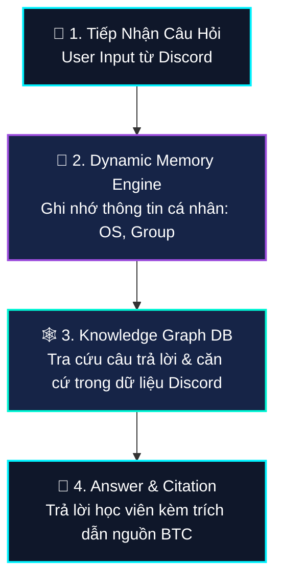
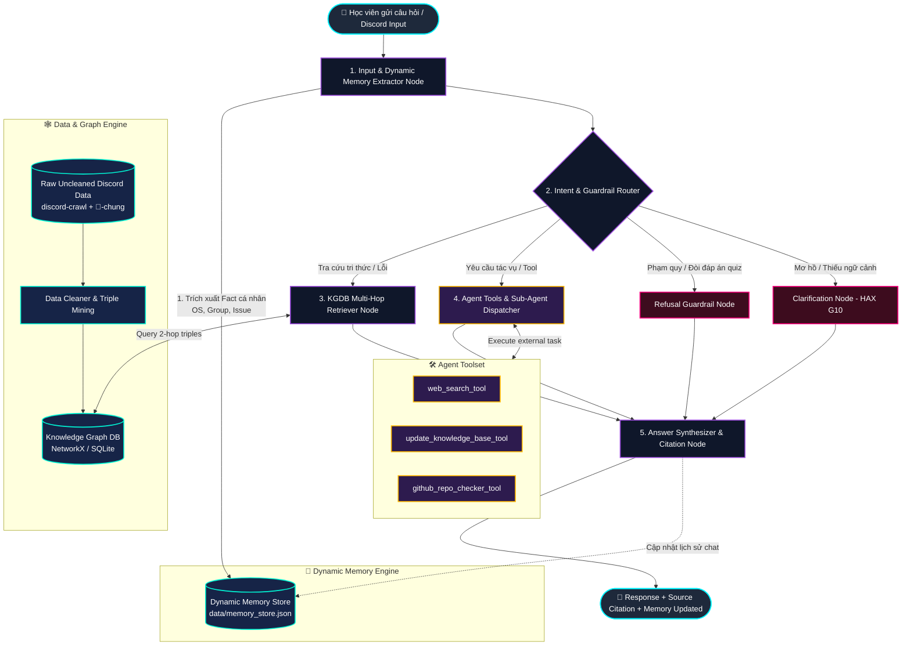
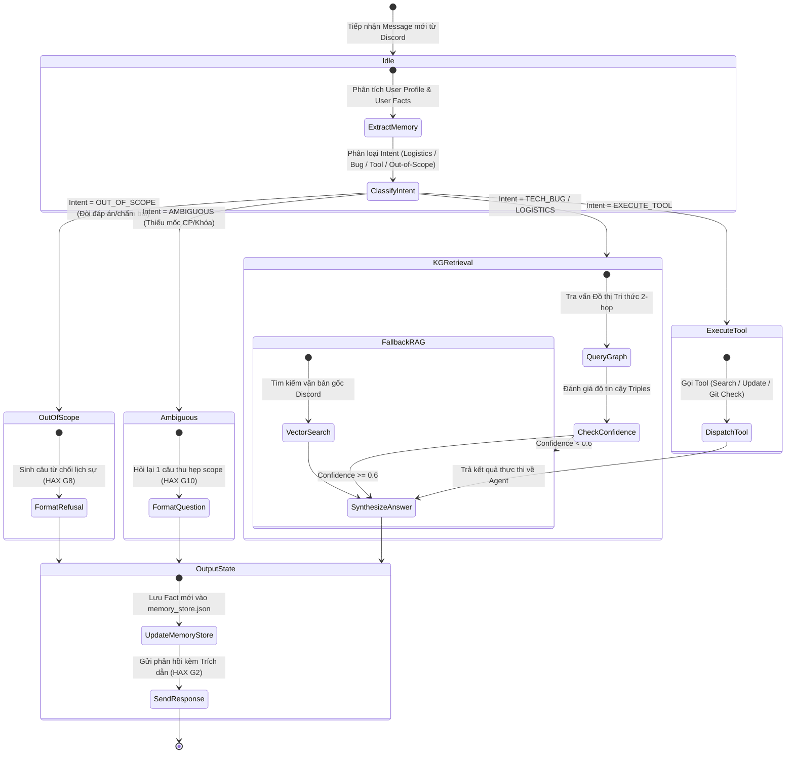
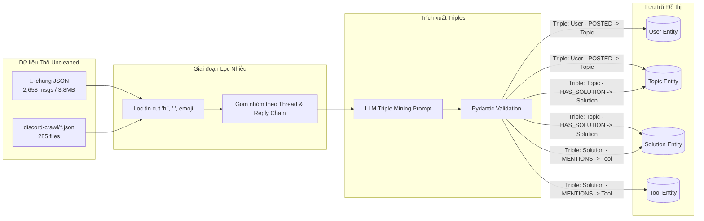

# SƠ ĐỒ HỆ THỐNG CHATBOT (LANGGRAPH + KNOWLEDGE GRAPH DB + DYNAMIC MEMORY)

## 0. Sơ Đồ Luồng Cơ Bản (Basic Bot Flow)

---

## 1. Sơ Đồ Kiến Trúc Luồng Nâng Cao (Full Advanced Architecture)

---

## 2. Sơ Đồ Chuyển Trạng Thái LangGraph (State Transition Machine Diagram)

---

## 3. Sơ Đồ Luồng Dữ Liệu ETL & Triples Mining (Data Pipeline Diagram)

