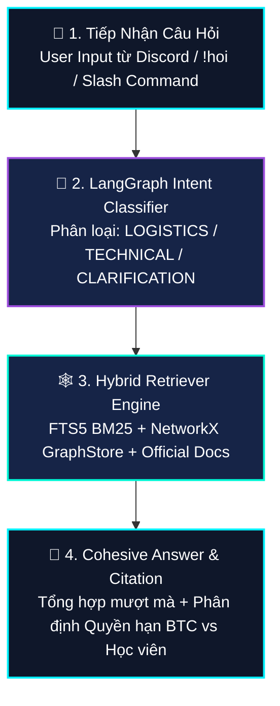
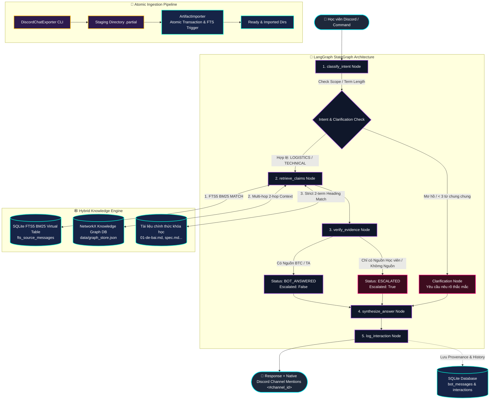
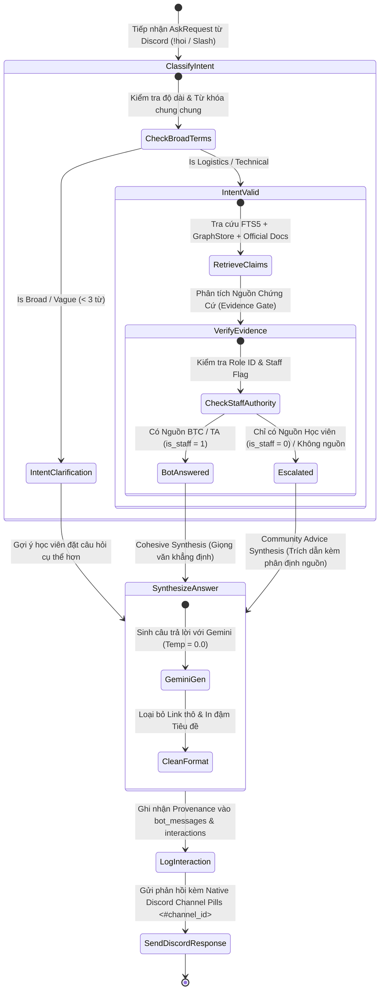
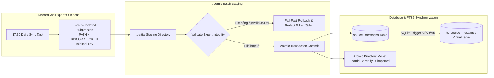

# SƠ ĐỒ HỆ THỐNG CHATBOT ODYSSEYBOT (LANGGRAPH STATEGRAPH + FTS5 + GRAPHSTORE)

## 0. Sơ Đồ Luồng Cơ Bản (Basic Bot Flow)

---

## 1. Sơ Đồ Kiến Trúc Luồng Nâng Cao (Full Advanced Architecture)

---

## 2. Sơ Đồ Chuyển Trạng Thái LangGraph StateGraph (State Machine Diagram)

---

## 3. Sơ Đồ Quy Trình Thu Thập & Đồng Bộ Dữ Liệu Nguyên Tử (Atomic Ingestion ETL)

