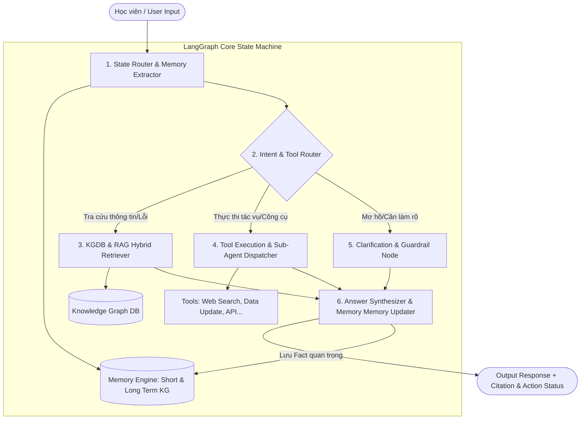

# KIẾN TRÚC & KẾ HOẠCH TRIỂN KHAI CHATBOT (LANGGRAPH + KNOWLEDGE GRAPH DB + MEMORY + TOOL AGENTS)

## 1. Tổng Quan Kiến Trúc (Architecture Overview)

Hệ thống Chatbot được thiết kế theo mô hình **Agentic State Machine** dựa trên **LangGraph**, kết hợp **Knowledge Graph Database (KGDB)** để lưu trữ tri thức tĩnh (dữ liệu Discord) và tri thức động (bộ nhớ hội thoại). Đồng thời, kiến trúc sẵn sàng cho việc mở rộng gọi các **Tools/Sub-Agents** thực thi tác vụ nâng cao.

> 🌐 **Giao diện Demo Luồng Interactive**: Đã khởi tạo tại file [index.html](file:///E:/AI/Lab/Batch03-K4-AI-Product-Hackathon/index.html) để mở trực tiếp trên trình duyệt.




---

## 2. Đáp Ứng 4 Yêu Cầu Cốt Lõi

### Yêu cầu 1: Sử dụng LangGraph & Knowledge Graph DB
* **LangGraph**: Đóng vai trò làm bộ não điều phối (State Graph), quản lý trạng thái luồng hội thoại (`ChatbotState`), luân chuyển giữa các node xử lý (Memory Extraction, Router, KG Retrieval, Tool Call, Answer Synthesis).
* **Knowledge Graph DB (KGDB)**: Lưu trữ dữ liệu dưới dạng Thực thể (Entity) - Mối quan hệ (Relation) - Thuộc tính (Attribute).
  * *Mô hình Đồ Thị Tri Thức*:
    * `(User)-[:POSTED_QUESTION]->(Topic)`
    * `(Topic)-[:HAS_SOLUTION]->(Solution)`
    * `(Solution)-[:MENTIONS_TOOL]->(Tool)`
    * `(User)-[:HAS_PROFILE]->(UserProfile)` (Thông tin nhóm, OS, công cụ đang dùng).

### Yêu cầu 2: Khai thác Dữ liệu Thô Discord (`data/discord-crawl` & `💬-chung`)
* **Hệ thống ETL & Cleaning Pipeline (`src/etl/`)**:
  * Clean tin nhắn nhiễu (tin nhắn cụt "hi", ".", tin nhắn bot) từ 285 file `discord-crawl` và file `💬-chung` (~3.8MB, 2.658 tin nhắn).
  * Trích xuất Triples tự động bằng LLM Extraction Prompt để đưa vào KGDB.

### Yêu cầu 3: Khả năng lưu thông tin "quan trọng" trong hội thoại (Dynamic Conversation Memory)
* **Short-Term Memory**: Lưu lịch sử chat 5-10 lượt gần nhất trong `ChatbotState`.
* **Long-Term Memory / Episodic Memory (Lưu vào KGDB)**:
  * Node `Memory Extractor` tự động phân tích tin nhắn của User để trích xuất các **Facts quan trọng**:
    * *Ví dụ*: User nhắn: *"Mình ở nhóm G14, đang dùng Windows bị lỗi AI Log trên Antigravity"*
    * $\rightarrow$ Trích xuất Fact: `(User:User_ID)-[:MEMBER_OF]->(Group:G14)`, `(User:User_ID)-[:USES_OS]->(OS:Windows)`, `(User:User_ID)-[:ENCOUNTERED_ISSUE]->(Issue:AI_Log_Fix_Windows)`.
  * Các thông tin này được ghi nhận trực tiếp vào KGDB và được truy xuất tự động ở các lượt chat tiếp theo.

### Yêu cầu 4: Mở rộng gọi Tool / Sub-Agent trong tương lai (Future-Proof Agentic Tools)
* **Node `Tool Execution & Sub-Agent Dispatcher`**:
  * Tích hợp LangGraph `ToolNode` có khả năng tự động bind các công cụ:
    1. `update_knowledge_base_tool`: Cập nhật/thêm dữ liệu quy định mới qua câu lệnh admin.
    2. `web_search_tool`: Tìm kiếm tài liệu ngoài internet khi KGDB chưa có dữ liệu.
    3. `github_repo_checker_tool`: Kiểm tra trạng thái commit AI Log trên repo nhóm.
    4. `vlearn_api_tool`: Tra cứu kết quả điểm danh QR / Codelabs.

---

## 3. Chi Tiết Các Hợp Phần Triển Khai (Proposed Components & Code Structure)

### 3.1 Cấu Trúc Thư Mục Dự Án (Tuân theo cấu trúc nộp bài tại README.md)
```
repo/
├── README.md                          ← Thành viên (mã HV + tên) + phân công từng phần
├── spec.md                            ← AI Spec sản phẩm theo template
├── demo-slides.pdf                    ← Slide 6 trang thuyết trình demo
├── codebase/                          ← Mã nguồn Prototype (ghi rõ phần mock/working)
│   ├── README.md                      ← Hướng dẫn chạy & mô tả phần mock/working
│   └── src/                           ← Source code chính
│       ├── main.py                    ← Discord Bot & CLI Interface
│       ├── config.py                  ← Cấu hình biến môi trường
│       ├── etl/                       ← Cleaning & Triples extraction pipeline
│       ├── graph_db/                  ← KG DB engine & Memory store
│       └── agent/                     ← LangGraph StateMachine, Nodes & Tools
├── eval/                              ← Golden set + Bảng kết quả đánh giá các lượt
├── validation/                        ← Feedback log từ vòng User Test
├── reflection/                        ← Bài thu hoạch cá nhân từng thành viên
└── docs/
    └── plan.md                        ← Kế hoạch & kiến trúc chi tiết
```

---

### 3.2 Định Nghĩa Trạng Thái LangGraph (`src/agent/state.py`)

```python
from typing import TypedDict, List, Dict, Any, Optional

class UserFact(TypedDict):
    fact_type: str  # "OS", "GROUP", "STUCK_ISSUE", "PREFERENCE"
    value: str
    timestamp: str

class ChatbotState(TypedDict):
    # Core Chat History
    messages: List[Dict[str, str]]
    user_id: str
    
    # Extracted Conversation Memory
    extracted_user_facts: List[UserFact]
    
    # Intent & Routing
    intent: str  # "LOGISTICS", "TECH_BUG", "EXECUTE_TOOL", "AMBIGUOUS"
    target_tool: Optional[str]
    
    # Graph & Context Retrieval
    kg_triples: List[Dict[str, Any]]
    retrieved_context: str
    
    # Output Generation
    final_response: str
    citations: List[str]
```

---

### 3.3 Chi Tiết Các Node Xử Lý Trong LangGraph (`src/agent/nodes.py`)

#### 1. `memory_extractor_and_router_node`
* **Nhiệm vụ**:
  * Phân tích tin nhắn mới nhất để phát hiện các thông tin cá nhân/ngữ cảnh quan trọng (Hệ điều hành, Mã nhóm, Lỗi đang gặp).
  * Gửi thông tin mới vào `MemoryStore` để cập nhật KGDB.
  * Phân loại Intent câu hỏi (Cần tra cứu KG, Cần gọi Tool, hay Cần hỏi lại).

#### 2. `kg_retriever_node`
* **Nhiệm vụ**:
  * Kết hợp thông tin từ hồ sơ User (trong MemoryStore) và từ khóa câu hỏi.
  * Truy vấn KGDB đa chặng (2-hop graph traversal): `(User Profile) -> (Topic) -> (Solution) -> (Code/Link)`.

#### 3. `tool_execution_node`
* **Nhiệm vụ**:
  * Gọi các tool tương ứng (`web_search`, `update_kb`, `check_git_status`).
  * Trả kết quả thực thi công cụ về trạng thái `ChatbotState`.

#### 4. `answer_synthesizer_node`
* **Nhiệm vụ**:
  * Tổng hợp thông tin từ KGDB + Kết quả Tool + Nguồn tài liệu BTC.
  * Sinh câu trả lời theo chuẩn HAX G2 (minh bạch trích dẫn nguồn) và HAX G10 (hỏi lại khi mơ hồ).

---

## 4. Kế Hoạch Kiểm Thử & Xác Minh (Verification Plan)

### Automated Tests (`pytest` / Scripts)
1. **Test ETL & Clean Data**:
   * Kiểm tra khả năng loại bỏ tin nhắn rác từ `💬-chung`.
2. **Test KGDB Traversal**:
   * Kiểm tra truy vấn đa chặng từ Entity `AI Log` -> ra Solution `overview.txt`.
3. **Test Memory Extraction**:
   * Test trường hợp user khai báo OS/Nhóm -> Kiểm tra xem lượt chat sau bot có nhớ không.
4. **Test Tool Execution**:
   * Test gọi `web_search_tool` hoặc `update_kb_tool` thành công.

### Manual Verification Checklist
- [ ] Gõ `!hoi Mình thuộc nhóm G14 dùng Windows` $\rightarrow$ Bot ghi nhận memory.
- [ ] Gõ tiếp `!hoi Sửa lỗi AI Log giúp mình` $\rightarrow$ Bot tự nhận diện Windows và đưa đúng hướng dẫn cho Windows.
- [ ] Gõ `!hoi Tìm kiếm giúp mình tài liệu LangGraph mới nhất` $\rightarrow$ Bot kích hoạt `web_search_tool`.

---

## 5. Phân Công Kỹ Thuật Chuyên Sâu (Chia Đều Việc Non-Tech Cho 3 Kỹ Sư)

| Thành viên | Phân vùng Kỹ Thuật (Module Technical) | Thư mục & File Code Phụ Trách | Nhiệm vụ Kỹ Thuật Chuyên Sâu | Nhiệm vụ Non-Tech Chia Đều (1/3) |
|---|---|---|---|---|
| **Thành viên 1** | **Data Engine & Triples Mining** | `codebase/src/etl/`<br>(`discord_cleaner.py`, `kg_triples_extractor.py`) | - Viết regex & LLM cleaning pipeline lọc 2.658 tin nhắn rác từ `💬-chung` và 285 file `discord-crawl`.<br>- Lập trình module trích xuất Entities & Triples `(Subject, Relation, Object)` bằng Pydantic. | - Phụ trách phần §1 & §2 trong `spec.md` (Evidence Mining, Problem Statement, Bảng Impact 3 ứng viên).<br>- Phỏng vấn & User Test với 2 người thử ngoài nhóm. |
| **Thành viên 2** | **Graph Database & Dynamic Memory** | `codebase/src/graph_db/`<br>(`graph_store.py`, `memory_store.py`) | - Lập trình Knowledge Graph Storage Engine (NetworkX/SQLite) hỗ trợ thuật toán truy vấn đa chặng (2-hop graph traversal).<br>- Xây dựng **Dynamic Memory Engine** tự động trích xuất & persistence User Facts dài hạn vào `data/memory_store.json`. | - Phụ trách phần §3, §4 & §5 trong `spec.md` (Benchmark, Automation cost-of-error, HAX/PAIR, 4 lớp chỗ khó).<br>- Phỏng vấn & User Test với 2 người thử ngoài nhóm. |
| **Thành viên 3** | **LangGraph Agent Engine & Bot Integration** | `codebase/src/agent/`<br>`codebase/src/main.py`<br>`eval/` (`golden_set.json`) | - Cài đặt **LangGraph State Machine** (`ChatbotState`, Memory Extractor Node, Router Node, KG Retriever Node, Synthesizer Node).<br>- Lập trình **Tool Call Node & Sub-Agent Dispatcher** (Web Search, Update KB, Git check).<br>- Tích hợp Discord Bot Python (`codebase/src/main.py`) & script test tự động Golden set. | - Phụ trách phần §6, §7 & §9 trong `spec.md` (4 đường đi trải nghiệm, Quality bar, Golden set, Changelog).<br>- Soạn Slide 6 trang & hỗ trợ kịch bản Demo. |


